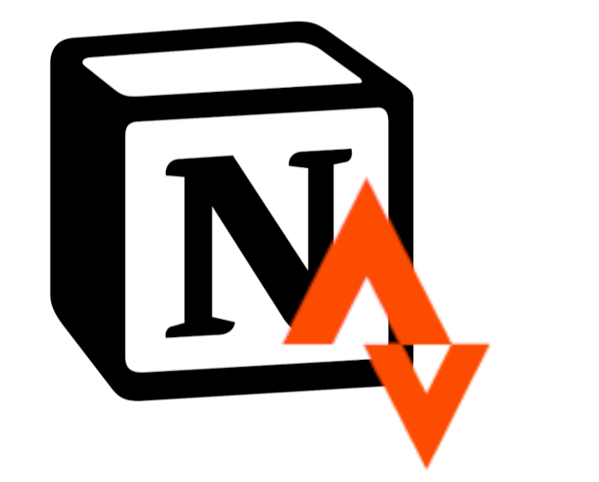
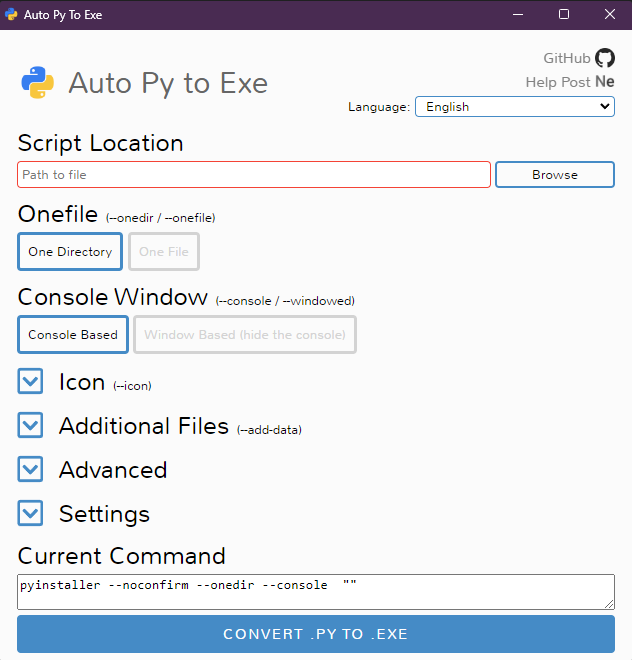
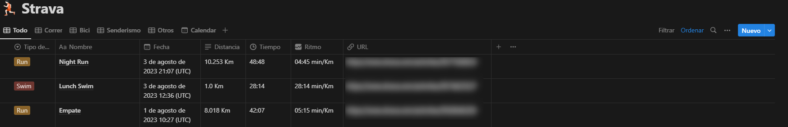
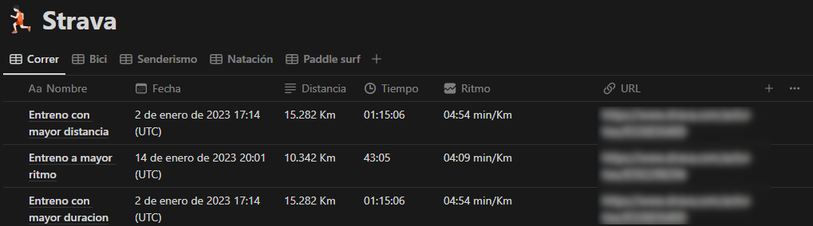

# Strava2Notion
Development of a Python application for the management and administration of Strava sports information and its automatic storage in the Notion application.

## Local installation

If desired, the code can be executed locally. To do this we must first clone the repository or download the code with the following command:

For a Windows operating system
```bash
gh repo clone PabloLHo/Strava2Notion
pip install -r requirements.txt
```
Once cloned, it will be necessary to fill in the user data for a correct use of notion and strava accounts and their APIs. You will be able to obtain the information to fill in these fields correctly in the following [document](https://www.strava.com/) associated with it.

Finally, once the application is complete for convenience, it is suggested to create a specific .exe file for its execution. For this purpose the auto-py-to-exe library has been used.

By means of the following commands we will be able to obtain the executable to be able to use this program when we require. We must open the command console and execute the following instructions:
```bash
pip install auto-py-to-exe
auto-py-to-exe
```
Once it has been executed, a window will open to fill in the data for the creation of the executable. 
<p align="center">
  
</p>
The most important data to fill in will be:

* The location of the main file main.py
* If you want an executable in a folder or as a single file.
* Select the command console execution

In addition to this, we will be able to give other data like selecting an icon as the one located in the resources folder or giving a name to the generated executable as well as indicating its output directory.

## Development

The development of this project starts from the practice of a subject of Computer Engineering at the University of Jaén called Algortimos Geométricos, the code base of the interface is developed by the professors Lidia Ortega Alvarado, Alfonso Lopez Ruiz. As an addition to the initial work, a series of practices were developed and can be found in the following .

The development of this project arises as a personal project due to the intention of storing the sports information linked to my person from the [Strava application](https://www.strava.com/) in the Notion data management application in the format of a database.

To achieve this has required access to both APIs of these applications whose access is public. In the presented program, first of all all the activities of a given user are obtained and all those that are not previously inserted will be introduced in the Notion database.

In order to facilitate the process, data authorization processes are automated through the use of libraries such as webdriver for browser management, since Strava requires authorization to access the data every time it is executed.

Regarding the Notion API, it should be noted that from the application itself it is necessary to give permissions to the database to access the program as well as to generate the well-known program integrations. All this will be further developed in the [section of installation and use of the program.](https://www.strava.com/).

## User Guide


## Execution examples

### Database populated with data
First, an image of a database enriched with sports information stored after running the program is presented.
<p align="center">
  
</p>


In addition to this, another database is developed with the best records in different aspects and disciplines as shown in the following image.
<p align="center">
  
</p>
